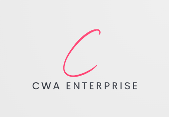

# Unit 20 Managing & Supporting Systems A2

This paper documents the management and support infrastructure of IT systems in a business.
It will cover the following points:

- Setting up PC's, server and printers
  - 30 PC's that share the same configuration which include:
    - Background image: 
    - Shortcuts to some apps listed below:
      - Word
      - Excel
      - Calculator
      - File Explorer
      - Google Chrome
  - A server which provides the following shared folders:
    - General folder
    - Policies and procedures folder
    - Management folder

Following the table below access control will be set up for the shared folders:

| Folder | User | Read | Write | Full |
|:-------|:-----|:-----:|:------:|:----:|
|General|All|-|-|X|
|Policies and procedures|Jr. Staff, Managers|X|-|-|
|Management|Managers|X|-|-|
|Management|Jr. Staff|-|-|-|
|All|Directors|-|-|X|

## Planning

Using task management tool ('Click Up') I have created a list of tasks that need to be completed in order to set up the infrastructure. The tasks are listed below as a Gantt chart:

Each task progress can be documented inside, also the tasks can be assigned a status and a priority.
I decided to go with these Statues:

- Mockup - The task is not yet started/ or is being written up as a draft
- Implementation - The task is being worked on and implemented.
- Complete - The task is completed.

## Network code of practice

The network code of practice is a document that outlines the rules and regulations of the network. It is important to have this document as it will help to keep the network secure and running smoothly. The document will be available to all users of the network and will be signed by them to show that they have read and understood the rules.

The document will include the following:

- Responsible and ethical use of the network

- Regular maintenance of the network and the standard

- Access control

- Network Traffic monitoring

- Network incident reporting/respone

The document will be signed by all users of the network and will be reviewed every 6 months.

