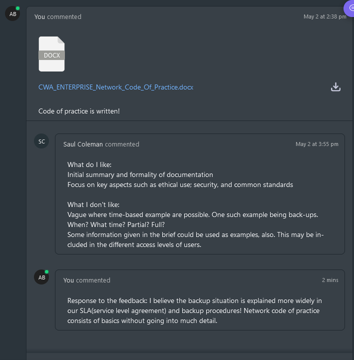
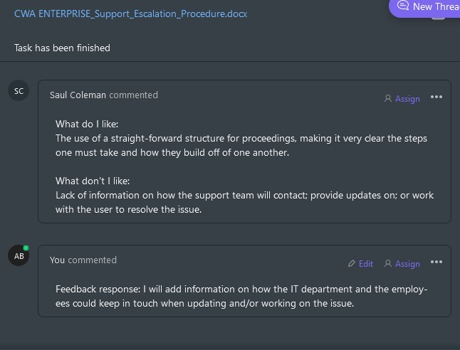
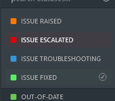

# Unit 20 Managing & Supporting Systems A2

This paper documents the management and support infrastructure of IT systems in a business.
It will cover the following points:

- Setting up PC's, server and printers
  - 30 PC's that share the same configuration which include:
    - Background image: 
    - Shortcuts to some apps listed below:
      - Word
      - Excel
      - Calculator
      - File Explorer
      - Google Chrome
  - A server which provides the following shared folders:
    - General folder
    - Policies and procedures folder
    - Management folder

Following the table below access control will be set up for the shared folders:

| Folder | User | Read | Write | Full |
|:-------|:-----|:-----:|:------:|:----:|
|General|All|-|-|X|
|Policies and procedures|Jr. Staff, Managers|X|-|-|
|Management|Managers|X|-|-|
|Management|Jr. Staff|-|-|-|
|All|Directors|-|-|X|

A mock-up of the management and support infrastructure which includes:

- Network code of practice
- Support request and escalation procedures
- contingency plan
- user support documentation
- security policy, access control and traffic management expectations
- user desktop interface
- backup procedures

## Planning

Using task management tool ('Click Up') I have created a list of tasks that need to be completed in order to set up the infrastructure. The tasks are listed below as a Gantt chart:

Each task progress can be documented inside, also the tasks can be assigned a status and a priority.
I decided to go with these Statues:

- Mockup - The task is not yet started/ or is being written up as a draft
- Implementation - The task is being worked on and implemented.
- Complete - The task is completed.

## System Setup

College Computers do not allow for the creation of different accounts **To be done at home**

------

## **Managing and Supporting Systems documentation**

## Network code of practice

The network code of practice is a document that outlines the rules and regulations of the network. It is important to have this document as it will help to keep the network secure and running smoothly. The document will be available to all users of the network and will be signed by them to show that they have read and understood the rules.

The document will include the following:

- Responsible and ethical use of the network

- Regular maintenance of the network and the standard

- Access control

- Network Traffic monitoring

- Network incident reporting/response

The document will be signed by all users of the network and will be reviewed every 6 months.

The document can be found in this folder named 'CWA ENTERPRISE Network Code of Practice.docx'

Below is a screenshot of the completed task in 'Click Up':

## Support request and escalation procedures

The support request and escalation procedures are a set of rules that need to be followed when a user has a problem with their computer. The document will be available to all users of the network and will be signed by them to show that they have read and understood the rules.

The document will include the following:

- How and where to report a problem

- What to do if the problem is not resolved

The document will be signed by all users of the network and will be reviewed every 6 months.

The document can be found in this folder named 'CWA ENTERPRISE Support Request and Escalation Procedures.docx'

Below is a screenshot of the completed task in 'Click Up':

## Service Level Agreement

The service level agreement is a document that outlines the level of service that the IT department will provide to the users of the network. The document will be available to owners of the business and will be signed by them to show that they have read and understood the terms.

The document will include the following:

- Service description

- Service availability

- Respone/Resolution times

- Costumer duties

- Service credit

- Termination

- Law

- Entire agreement

The document will be signed by the owners of the business and will be reviewed every 2 years.

The document can be found in this folder named 'CWA ENTERPRISE Service Level Agreement.docx'

Below is a screenshot of the completed task in 'Click Up':

### User support documentation

The user support documentation is a set of documents that will help the users of the network to resolve common problems in the system thus reducing amount of issues raised. The guide will be available to all users of the network and will be reviewed every 2 months(DEPENDING ON HOW MUCH IT HELPS).

The document will include the following:

- How to resolve common problems

- How to contact the IT department

- How to submit an issue via ClickUp

Below is a screenshot of the completed task in 'Click Up':

## Security policy, access control and traffic management expectations

Security policy is a document that outlines the rules and regulations of the network. It is important to have this document as it will help to keep the network secure and contained from outside threats.

The document will include the following:

- Password policy
  
- Traffic management

  Includes:

  - Firewall

  - Intrusion detection system(IDS)

  - Virtual Private Network(VPN)

- Incident response

- Compliance

- Enforcement

Below is a screenshot of the completed task in 'Click Up':

## Backup procedures

Backup procedure will define how the data will be backed up by the organisation.

The document will include the following:

- Backup schedule

- Backup location

- Compliance

Below is a screenshot of the completed task in 'Click Up':

## Network and System requirements

System and network requirements are critical considerations when deploying software or applications within a business organization. In order to ensure optimal performance and avoid any technical difficulties, it's important to have the appropriate hardware and software specifications in place.

For a business organization that requires 30 computers and printers, it's recommended to have at least one server to manage the network and data storage. The server should meet the following specifications:

Processor: A modern multi-core processor with clock speeds of 2 GHz or higher.
Memory (RAM): At least 8 GB of RAM or higher, depending on the number of users and applications that will be running on the server.
Storage: Sufficient storage capacity to accommodate the organization's data needs. For example, 1 TB or more of hard disk space may be required.
Operating system: A server operating system such as Windows Server or Linux that is compatible with the organization's applications and network infrastructure.

For the 30 computers, the minimum system requirements should be as follows:

Processor: A modern multi-core processor with clock speeds of 2 GHz or higher.
Memory (RAM): At least 4 GB of RAM or higher, depending on the applications that will be used.
Storage: At least 500 GB of hard disk space or more, depending on the amount of data that will be stored locally.
Operating system: A modern operating system such as Windows 10 or macOS that is compatible with the organization's applications.
The printers should be network-enabled and compatible with the organization's network protocols. It's recommended to choose printers with high-capacity ink or toner cartridges to minimize the need for frequent replacements.

In terms of network requirements, the organization should have the following:

Sufficient bandwidth to accommodate the number of users and data transfer needs.
Low latency to ensure smooth communication between the computers, printers, and server.
Adequate security measures, such as firewalls and anti-virus software, to protect against potential cyber threats.
Overall, having the appropriate system and network requirements in place can help ensure that the business runs smoothly and efficiently. It's important to consult with IT professionals to ensure that the organization's hardware and software infrastructure is optimized for the business's specific needs.

## User desktop interface(System setup)

System setup consists of the following requirements:

- Applications:
  - Word(Word processing software)
  - Excel(Spreadsheet software)
  - Google Chrome(Web browser)

- Uniform desktop background
  - The desktop background should be the same for all users of the network. This will help to keep the network uniform and professional
  
    

- Relevant folders

  - Only the users that have access to the specifc folder may see it on the desktop. This will help to avoid clutter on the desktop and keep it clean.

### Setting up the shared folders

1. Right click on the folder that you want to share and select 'Properties'

    

2. Select the 'Sharing' tab and click on 'Advanced Sharing'

    

3. Tick the box that says 'Share this folder' and click on 'Permissions'

    

4. Select the users that you want to have access(Read, Write, Full) to the folder and click on 'OK'

5. Apply changes and click on 'OK'

6. Repeat the process for all the folders that you want to share

### Setting up the desktop background

1. Win + R and type 'gpedit.msc' and click on 'OK'

    

2. Navigate to 'User Configuration' -> 'Administrative Templates' -> 'Desktop' -> 'Desktop'

    

3. Double click on 'Desktop Wallpaper'

    

4. Select 'Enabled' and type in the path to the image that you want to use as the desktop background and press 'Apply' and 'OK'

    

5. Right click on the Start Menu Button and select command prompt or command prompt (Admin) to open the CMD window. Type: gpupdate /force and hit ENTER.

    

6. Close the CMD window and check if the desktop background has changed (May require to sign out and sign in again)

    

### Final result

This section will show what the desktop will look like for each user type.

#### Jr. Staff

#### Managers

#### Directors

## Testing, Optimisation and Evaluation

For testing my solution I have decided to share my folders with my colleagues and ask them to give me feedback on the solution and the policies.

To keep track of all my feedback my peers have written the feedback in a relevant clickup task like this:

### Feedback section:

|ID|Feedback|Document in review|
|---|---|---|
|1|| Network Code of Practice|
|2|| Support & Esclation procedures|
|3|| User Support Documentation|

## Issue tracking via clickup

Clickup is a project management tool that allows you to create tasks and assign them to people. It also allows you to create subtasks and checklists to keep track of the progress of the task.

Clickup also allows you to create a 'Space' which is a collection of folders that are related to each other.

I have decided to use clickup to track network issues in the organisation. I have created a list called 'Issue_Tracking', which will allow employees to create issues as tasks(with a template) and assign them to the IT department.

The issue task then can be used for communications, updates and to keep track of the progress of the issue.

- Issue raised: The issue has been raised by an employee and is waiting to be recognised by the IT department

- Issue escalated: The issue has not been resolved or has taken too long to resolve and has been escalated to the next level

- Issue troubleshooting: The issue is being investigated and fixed by the IT department

- Issue fixed: The issue has been fixed and the employee has been notified, no further action needed.

- Out-Of-Date: To avoid clutter on the board, the issue will be deleted or archived after 30 days of being fixed.

### Tracking issues

For the issue not to get lost the template has been created to ensure that all the relevant information is provided, click up also allows provides task ID's and custom ID's to keep track of the issues. The task will also have set dates.

### Testing the solution

To test the solution I have been provided with a list of sample issues that I have to resolve. The issues are as follows:

|ID|Issue|
|---|---|
|1|"I am unable to access my email account through the company's email server. Can you help me troubleshoot this issue?"|
|2|"I cannot access any of the shared files on the network. Is there something wrong with the network settings?"|
|3|"I am receiving an error message when I try to access a specific website. Is there something wrong with the network or is it a problem with the website?"|

Now to begin troubleshooting the issues the user will have to provide the information in this format

1. He creates a new task and selects the template 'Report an issue'

    

2. He fills out the template and provides the information that is required

    Issue #1:

      The user has provided the following information and started a thread in the task to communicate with the IT department:

      

      IT Technician has responded to the issue and has asked the user to provide more information(This information will be stored in the task description to keep note for the future):

      

      IT Technician has set the task as 'Issue troubleshooting' and has started to troubleshoot the issue:

      

      IT Technician has fixed the issue and has set the task as 'Issue fixed':

      

    Issue #2:

      The user has provided the following information and started a thread in the task to communicate with the IT department:

      

      IT Technician has responded to the issue and has asked the user to provide more information(This information will be stored in the task description to keep note for the future):

      

      IT Technician has set the task as 'Issue troubleshooting' and has started to troubleshoot the issue. The IT Technician has also escalated the issue to the next level(Due to the issue being more complex):

      

      The IT technician has found out that Jr. Staff is trying to access a folder without clearance, the IT technician has informed the user that he should not be able to access the folder and has noted down the possible security concerns in the task description, to make sure that directors are aware of the issue:

      

      

      The network not found error was caused by the user not being able to access the folder, the issue has been fixed, but the task will remain escalated due to potential security concerns.

    Issue #3:

      The user has provided the following information and started a thread in the task to communicate with the IT department:

      

      IT Technician has responded to the issue and has asked the user to provide more information(This information will be stored in the task description to keep note for the future):

      

      IT Technician has fixed the issue like this:

      

## Testing in depth

Testing plays a crucial role in the management and support infrastructure of an IT system. It is a systematic process of evaluating the system's functionality, performance, and security to ensure that it meets the specified requirements and performs reliably in real-world scenarios. The primary objective of testing is to identify any defects, errors, or vulnerabilities in the system and take corrective actions to enhance its quality and reliability.

### Types of testing

- **System Testing:** System testing evaluates the entire IT system as a whole, ensuring that all integrated components function together correctly and meet the specified requirements. It focuses on verifying the system's functionality, performance, security, and compliance with business needs. System testing includes both functional and non-functional testing activities.
  - Verify that all integrated components of the IT system, such as servers, databases, and client applications, function correctly together.
  - Test end-to-end workflows to ensure seamless data flow and communication between different system modules.
  - Validate that the system meets the specified performance requirements, such as response times, throughput, and resource utilization.
  - Assess the system's security measures by performing penetration testing to identify vulnerabilities and potential breaches.
  - Evaluate the system's compliance with relevant industry standards and regulations.

- Functional Testing: Functional testing verifies that the system's functions and features meet the specified requirements. It focuses on testing the system's functionality, usability, and accessibility. Functional testing includes both manual and automated testing activities.
  - Test various user interactions and scenarios to ensure that all functions and features of the system are working as expected.
  - Verify that user inputs and actions generate the correct outputs and trigger the appropriate system responses.
  - Validate that the system adheres to the defined business rules and logic.
  - Check the usability and accessibility of the system, ensuring that it is intuitive and easy to navigate for users with different levels of expertise.

- Performance Testing: Performance testing measures the system's responsiveness, scalability, and stability under expected or increased workloads. It aims to identify performance bottlenecks, such as slow response times or resource limitations, and optimize the system to handle the anticipated user activity.
  - Measure the system's response times under different user loads to identify any performance bottlenecks.
  - Test the system's scalability by gradually increasing the number of concurrent users or transactions to ensure it can handle the expected workload.
  - Assess the system's stability and resource usage to ensure it can sustain prolonged usage without degradation.
  - Identify any memory leaks, CPU spikes, or network latency issues that may affect performance.

- Security Testing: Security testing assesses the system's ability to protect data, prevent unauthorized access, and mitigate potential security risks. It involves testing the system for vulnerabilities, such as weak authentication mechanisms or inadequate encryption, and ensuring compliance with security policies and regulations.
  - Conduct vulnerability scans and penetration testing to identify potential security weaknesses, such as SQL injections or cross-site scripting (XSS) vulnerabilities.
  - Validate the effectiveness of authentication and authorization mechanisms, ensuring that only authorized users can access sensitive data or perform privileged actions.
  - Test encryption protocols and algorithms to ensure the confidentiality and integrity of data during transmission and storage.
  - Assess the system's resistance to common security threats, such as denial-of-service (DoS) attacks or brute force attacks.

- Regression Testing: Regression testing is performed after modifications or updates to the system to ensure that existing functionalities continue to work as intended. It retests previously tested components and functionalities to uncover any new defects or regressions caused by recent changes.
  - Re-execute previously executed test cases to verify that existing functionalities have not been impacted by recent system changes or updates.
  - Test critical paths and frequently used features to ensure they still function as intended.
  - Validate that bug fixes or enhancements have not introduced new defects or regressions in other parts of the system.
  - Perform compatibility testing to ensure that system modifications are compatible with different operating systems, browsers, or hardware configurations.

These are just a few examples of testing scenarios. The actual testing scope will depend on the characteristics of the IT system being tested.

## Justification of the solution

### Documents

#### Network Code of Practice

This document outlines the standard operating procedures for managing and maintaining the network. It helps ensure that all IT staff and users follow the same protocols, thereby reducing the risk of errors, system failures, and security breaches.

#### User Support Documentation

This document provides users with the necessary information to troubleshoot basic issues on their own without relying on IT support. It also helps IT support to address user issues more efficiently, as users can provide detailed information about the issue they are facing.

#### Backup procedures

This document details the backup procedures for critical data, applications, and system settings. It ensures that data is backed up regularly, reducing the risk of data loss due to hardware or software failures, natural disasters, or cyber-attacks.

#### Serivce Level Agreement(SLA)

This document specifies the expected level of service from IT support and outlines the responsibilities of both IT support and users. It helps manage user expectations and sets clear guidelines for resolving issues in a timely and efficient manner.

#### Support & Escalation procedures

This document outlines the steps that IT support staff should take when they encounter an issue that they are unable to resolve. It ensures that issues are escalated to the appropriate person or team, ensuring timely resolution and reducing downtime for users.

#### Security Policy

This document outlines the policies, procedures, and guidelines for securing the network and protecting sensitive information from unauthorized access or theft. It helps ensure that all users and IT staff are aware of their responsibilities in maintaining network security and minimizing the risk of data breaches.

- Strengths

  - Standardization and Consistency: The Network Code of Practice, User Support Documentation, Backup Procedures, Service Level Agreement (SLA), Support & Escalation Procedures, and Security Policy all contribute to standardizing processes and practices within the organization. By establishing clear guidelines and protocols, these documents ensure that IT staff and users follow consistent procedures, reducing the risk of errors, system failures, and security breaches.
  - User Empowerment: The User Support Documentation plays a crucial role in empowering users to troubleshoot basic issues independently. By providing detailed information and instructions, users can attempt to resolve common issues on their own, reducing their reliance on IT support. This improves efficiency in IT support services and empowers users to take ownership of their technology-related challenges.
  - Risk Mitigation: The Backup Procedures and Security Policy documents address critical areas of risk within the organization. Backup procedures ensure that critical data, applications, and system settings are regularly backed up, reducing the risk of data loss. The Security Policy establishes guidelines and responsibilities for network security, minimizing the risk of unauthorized access and data breaches. By proactively addressing these risks, the organization enhances its resilience and protects sensitive information.
  - Clear Communication and Expectations: The Service Level Agreement (SLA) outlines the expected level of service from IT support and establishes clear guidelines for issue resolution. By defining response times, priorities, and responsibilities, the SLA helps manage user expectations and ensures that issues are addressed in a timely and efficient manner. This clear communication fosters transparency and accountability within the IT support process.

- Weaknesses
  
  - Lack of Regular Review and Updates: To ensure continued effectiveness, it is important to regularly review and update these policies and agreements. Technological advancements, evolving security threats, and changing user needs require periodic reassessment and adjustments. Failure to review and update these documents may result in outdated practices or insufficient safeguards.
  - Limited User Awareness and Training: While the existence of these policies and agreements is important, their effectiveness relies on user awareness and understanding. It is crucial to provide comprehensive training and regular communication to ensure that users are aware of the policies and understand their responsibilities. Insufficient training or lack of awareness can lead to non-compliance and increased risk exposure.
  - Inadequate Integration and Enforcement: It is important to ensure that these policies and agreements are effectively integrated into the organization's IT infrastructure and daily operations. This includes implementing mechanisms for monitoring and enforcing compliance with the established procedures. Inadequate integration and enforcement can undermine the effectiveness of these documents and lead to inconsistent practices.
  - Limited Flexibility and Adaptability: It is important to strike a balance between standardization and flexibility. While standardized procedures are valuable for consistency, there should also be room for flexibility to address unique requirements or emerging situations. The documents should be regularly evaluated to ensure they remain aligned with the organization's evolving needs and can adapt to changing circumstances.
  
### Desktop interface

A unified desktop interface can bring several benefits to a business.

First, it can improve the overall user experience by providing employees with a consistent and familiar interface across all applications and tools they use in their daily work. This can reduce the learning curve for new tools and increase productivity by reducing the time spent switching between different interfaces.

A unified desktop interface can simplify IT management by reducing the number of different interfaces and tools that need to be supported. This can reduce the workload for IT staff and lower the overall IT costs for the business.

Similar desktop interface can enhance security by enforcing consistent security policies across all applications and tools. This can reduce the risk of security breaches and improve compliance with regulatory requirements.
In evaluating the use of a unified desktop interface, I have found several strengths and weaknesses in its implementation.

- Strengths
  
  - Improved User Experience: By providing a consistent and familiar interface, a unified desktop interface enhances the overall user experience. Employees can easily navigate and interact with various applications and tools, reducing the learning curve for new tools and improving productivity.
  - Streamlined IT Management: Implementing a unified desktop interface reduces the number of different interfaces and tools that IT staff need to support. This simplifies IT management processes, as IT teams can focus on maintaining and troubleshooting a single interface, leading to improved efficiency and reduced workload.
  - Cost Reduction: With fewer interfaces to support, the organization can experience cost savings in terms of software licensing, training, and support. By standardizing the interface, the need for specialized training or support for multiple applications is minimized, resulting in lower overall IT costs.
  - Enhanced Security: A unified desktop interface allows for the enforcement of consistent security policies across all applications and tools. This helps mitigate the risk of security breaches by ensuring that security measures are uniformly applied, reducing potential vulnerabilities and enhancing compliance with regulatory requirements.

- Weaknesses
  
  - Compatibility Issues: Implementing a unified desktop interface may face challenges when integrating with legacy or specialized applications that do not conform to the standardized interface. Compatibility issues could arise, requiring additional effort and resources to address.
  - User Resistance to Change: Introducing a new desktop interface may face resistance from employees accustomed to different interfaces. Some employees may find it difficult to adapt to the new interface, potentially leading to a temporary decrease in productivity until they become familiar with the changes.
  - Limitations in Customization: A unified desktop interface may have limitations in terms of customization options. This could result in an interface that does not fully meet the specific needs of different user roles or departments, potentially leading to inefficiencies or workarounds.
  - Training and Transition Efforts: Implementing a unified desktop interface requires proper training and transition efforts to ensure a smooth adoption process. Adequate training and support should be provided to help employees navigate the new interface and understand its features and functionalities.
  
### Use of Clickup to track issues

ClickUp is an effective tool for tracking IT issues for several reasons. It allows IT teams to easily create, assign, and prioritize tasks, ensuring that nothing falls through the cracks. The ability to attach files and add comments to tasks means that important information is readily available, reducing the need for additional communication and speeding up the resolution process.

Customizable task statuses and workflows which make it easy for teams to track the progress of issues and identify any bottlenecks. It also provides automated notifications, keeping team members up-to-date on changes and ensuring that everyone is on the same page.

Useful features that can be used across IT teams, such as time tracking, integrations with other tools(like GitHub). This can help teams to improve their productivity and efficiency and bring everything together in one place.

It provides a centralized platform for IT teams to track, manage, and resolve issues quickly and efficiently

- Strengths:

  - Centralized Platform: ClickUp provides a centralized platform for IT teams to track and manage issues. This ensures that all relevant information, tasks, and discussions are organized and easily accessible in one place, improving collaboration and efficiency.
  - Task Creation and Assignment: ClickUp allows IT teams to create tasks for different issues and assign them to specific team members. This helps in clearly defining responsibilities and ensuring that issues are addressed by the appropriate personnel.
  - Priority and Status Management: The tool enables the assignment of priorities and statuses to tasks, allowing IT teams to prioritize and track the progress of each issue. This helps in identifying critical issues and allocating resources accordingly.
  - File Attachments and Comments: ClickUp supports file attachments and comments on tasks, enabling IT teams to share relevant files, screenshots, or additional information related to issues. This facilitates effective communication and reduces the need for separate channels of communication.
  - Notifications and Reminders: ClickUp provides automated notifications and reminders for task updates and changes. This keeps team members informed about any modifications to tasks, ensuring everyone stays up-to-date and reducing the chances of miscommunication.

- Weaknesses:
  
  - Learning Curve: Adopting a new tool like ClickUp may require a learning curve for IT teams who are not familiar with its interface and functionalities. This initial learning phase may temporarily impact productivity until team members become proficient in using the tool.
  - Integration Limitations: While ClickUp offers integrations with various tools like GitHub, there may be limitations or compatibility issues with certain existing IT systems or workflows. It is important to ensure that ClickUp integrates seamlessly with all necessary systems to avoid any disruptions or data inconsistencies.
  - Customization Complexity: Although ClickUp allows customization of task statuses, workflows, and other settings, configuring these options may require advanced knowledge and administrative permissions. This complexity could lead to difficulties in tailoring the tool to specific team needs or making adjustments as requirements evolve.
  -Dependency on Internet Connection: ClickUp operates as a cloud-based solution, which means it relies on a stable internet connection. In cases of network outages or limited connectivity, accessing and updating tasks in real-time may be affected, potentially delaying issue resolution and communication.
  - Cost Considerations: ClickUp offers both free and paid plans, with additional features available in the paid versions. Depending on the organization's budget and specific requirements, the cost of ClickUp's paid plans may need to be taken into account when evaluating its overall value and feasibility.

## Optimizations

Some approaches to optimize the IT systems:

### Performance

- Identify and analyze performance bottlenecks using various tools and techniques, such as load testing, profiling, and monitoring. This can help identify potential issues before they become critical and allow teams to take proactive measures to address them.

- Implement caching mechanisms to reduce the load on servers and improve response times for frequently accessed data. This can help improve the overall performance of the system and reduce the risk of downtime due to server overload.

- Fine-tune system configurations and parameters to optimize resource allocation and utilization.

- Upgrade hardware components, such as CPUs or memory, to improve system processing capabilities.

- Implement load balancing techniques to distribute workloads evenly across multiple servers.

### Energy efficiency

- Identify and replace energy-consuming hardware components with energy-efficient alternatives.
  
- Implement power management features to optimize energy consumption during idle periods.

- Use energy monitoring tools and implement energy-efficient practices identifying and reduce energy wastage.

### Reliability

- Implement redundant and fault-tolerant configurations to ensure high availability and minimize downtime.
  
- Implement backup and disaster recovery solutions to protect against data loss and system failures.
  
- Regularly test and validate the effectiveness of backup and recovery procedures.
  
- Implement monitoring and alerting systems to proactively identify and address system issues.
  
- Regularly apply system updates, patches, and security fixes to maintain system stability and reliability.

## Meeting the requirements

The following checklist can be used to ensure that the IT systems has met the requirements:

- [x] Setting up PC's, server and printers
  - [x] 30 PC's that share the same configuration which include:
    - [x] Background image:
  
      

    -[x] Shortcuts to some apps listed below:

    - [x] Word
    - [x] Excel
    - [x] Calculator
    - [x] File Explorer
    - [x] Google Chrome

  - [x] A server which provides the following shared folders:
  
    - [x] General folder
    - [x] Policies and procedures folder
    - [x] Management folder
  - [x] Correct access rights to the shared folders(Tabled below):
  
    | Folder | User | Read | Write | Full |
    |:-------|:-----|:-----:|:------:|:----:|
    |General|All|-|-|X|
    |Policies and procedures|Jr. Staff, Managers|X|-|-|
    |Management|Managers|X|-|-|
    |Management|Jr. Staff|-|-|-|
    |All|Directors|-|-|X|

  - [x] A mock-up of the management and support infrastructure which includes:

    - [x] Network code of practice
    - [x] Support request and escalation procedures
    - [x] Contingency plan
    - [x] User support documentation
    - [x] Security policy, access control and traffic management expectations
    - [x] User desktop interface
    - [x] Backup procedures
  